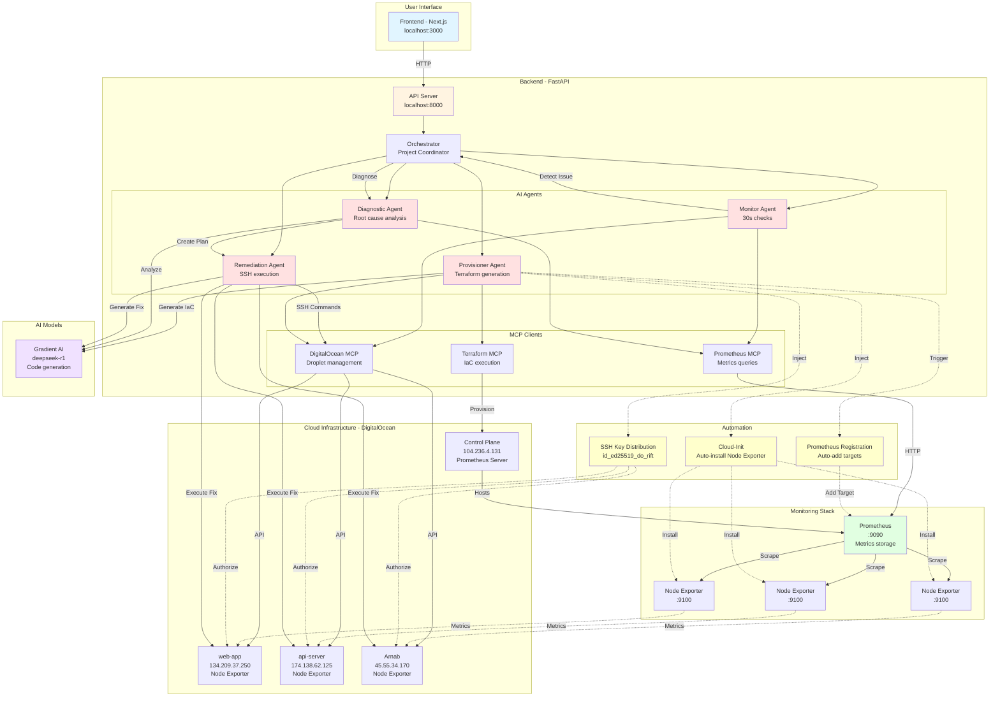

# RIFT Platform Architecture



## Flow Explanation

### 1. **Provisioning Flow** (New VM Creation)
```
User → Frontend → API → Provisioner Agent → Gradient AI (Generate Terraform)
→ Terraform MCP → DigitalOcean API → New Droplet Created
→ Cloud-Init installs Node Exporter
→ SSH Key injected automatically
→ Prometheus Registration adds monitoring target
```

### 2. **Monitoring Flow** (Continuous)
```
Monitor Agent (every 30s) → PromMCP → Prometheus → Query Metrics
→ Check CPU/Memory/Disk for all droplets
→ If threshold exceeded → Trigger Incident
```

### 3. **Remediation Flow** (Autonomous)
```
Incident Detected → Diagnostic Agent → Analyze root cause via Prometheus
→ Remediation Agent → Generate fix commands via Gradient AI
→ Execute SSH commands on affected droplet
→ Verify recovery → Close incident
```

### 4. **Architecture Highlights**
- **Zero-Touch Provisioning**: New VMs automatically get monitoring + SSH access
- **Autonomous Healing**: Incidents detected and fixed without human intervention
- **Multi-Cloud Ready**: MCP pattern allows easy cloud provider abstraction
- **AI-Powered**: Gradient AI generates Terraform code and remediation commands
